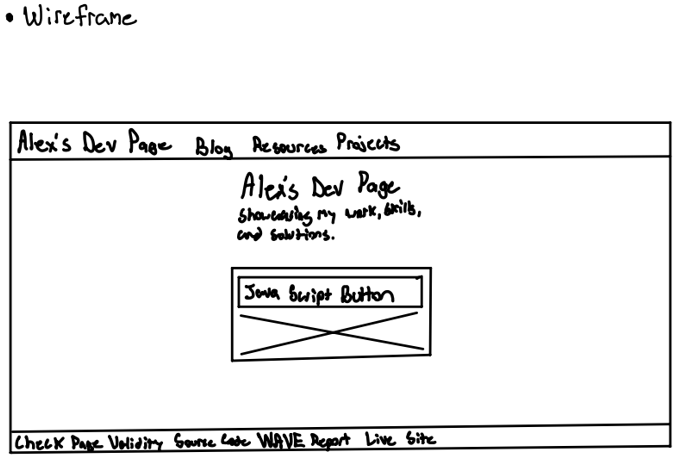

# Project Alpha

<!-- One new line is a space, two lines is a line break -->

This is Project Alpha for CIS-376 Web Development.

## Project

This is a simple website that has four pages. This project allowed us to practice our HTML, JavaScript, and CSS languages, implementing these into our website. We are also required to have a consistnent navbar and footer along with quick links to our repository, live site, Nu report, and WAVE report.

## Page Map

<!-- Format to link items inside of md -->

- [Index](docs/index.html)
- [Blog](docs/pages/blog.html)
- [Resources](docs/pages/resources.html)
- [Projects](docs/pages/projects.html)

## Live Site

The live site link can be found in the footer or also using this link

- [Live Site](https://alex-copeland-5.github.io/alex-copeland-5/)

<!-- https://docs.github.com/en/get-started/writing-on-github/working-with-advanced-formatting/creating-and-highlighting-code-blocks -->

## JavaScript Code Snippet

This is the code I used for my JavaScript requirement. This function generates a random number from 1-100 on click of a button. Then, the function updates the text of our button element that we clicked.

```js
document.getElementById("randomBtn").addEventListener("click", function () {
  // Generate a random number between 1 and 100
  let randomNumber = Math.floor(Math.random() * 100) + 1;

  document.getElementById("randomNumberDisplay").textContent = "Your random number is " + randomNumber + "!";
});
```

## Wireframe



## Credit

Here are the following website I used to research for this project.

- [Color Scheme Generator](https://colorffy.com/dark-theme-generator?colors=ed1ca7-121212)
- [How to align a div](https://sentry.io/answers/how-to-align-a-div-to-the-middle-horizontally-width-of-the-page/)
- [Columned Div's](https://www.w3schools.com/css/css3_flexbox.asp)
- [HTML Images](https://www.w3schools.com/html/html_images.asp)
- [Alt text for images](https://www.w3schools.com/tags/att_img_alt.asp)
- [Markdown Code Snippet](https://docs.github.com/en/get-started/writing-on-github/working-with-advanced-formatting/creating-and-highlighting-code-blocks)
- [How to write a GOOD README](https://www.freecodecamp.org/news/how-to-write-a-good-readme-file/)
